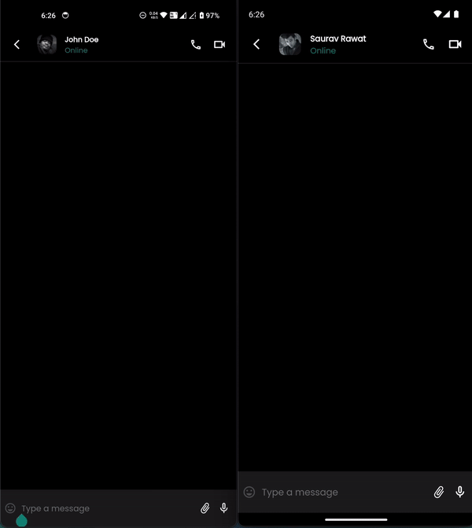

# 📱 Flutter WhatsApp (Rethinked!)

**Flutter WhatsApp (Rethinked!)** — a powerful, secure, and feature-rich messaging platform built using Flutter & Firebase. This app provides a smooth, real-time messaging experience with a focus on privacy and user convenience. Whether you're chatting one-on-one or in groups, this app offers everything you need to stay connected!

## 🖥️ Demo



## 🚀 Features

### 🔐 **Authentication**

- Secure login with email/password or third-party OAuth (Google, Facebook, etc.).
- Smooth, reliable, and scalable user authentication flow.

### 🔐 **End-to-End Encryption**

- Your text messages are fully **end-to-end encrypted**, ensuring that only you and the recipient can read them.
- Your data stays private and secure at all times.

### 💬 **One-to-One Chat**

- Enjoy private, real-time conversations with other users.
- Send text, multimedia messages, and much more!

### 👥 **Group Chat**

- Seamlessly chat with multiple people at once.
- Create and manage groups to communicate with friends, family, or team members.
- **Group Mentions**: Tag any group member by starting with `#` followed by their name to notify them directly.

### 🖼 **Multimedia Messaging**

- Send and receive **photos**, **videos**, **locations**, **contacts**, and **documents**.
- Fully integrated file sharing with seamless experience for attachments.

### 🟢 **Online/Offline & Last Seen Status**

- Know if your friends are online or offline in real-time.
- See when users were last active, enhancing your chat experience.

### ✏️ **Typing Indicator**

- Know when someone is typing a message in real-time.
- A helpful typing indicator lets you stay updated during conversations.

### ✅ **Read Receipts & Delivery Status**

- **Delivery Status**: Easily see when your messages have been successfully delivered.
- **Read Receipts**: Know when your messages have been read by the recipient with intuitive indicators.

### ✏️ **Edit Messages**

- Made a mistake? No worries! Edit your sent messages anytime.

### 🗑 **Delete Messages**

- Delete any message for yourself or for everyone in the chat.

### 📞 **Voice Calls**

- Crystal clear voice calls with low latency for a great calling experience.
- Perfect for quick conversations or meetings.

### 🎥 **Video Calls**

- Enjoy high-quality video calls with your contacts.
- Connect face-to-face with friends, family, or colleagues from anywhere in the world.

---

## 🛠 **Technology Stack**

- **Framework**: Flutter (Dart), Firebase
- **State Management**: Provider
- **Real-time Messaging**: Firebase Realtime Database
- **Multimedia Handling**: Firebase Storage
- **Push Notifications**: Firebase Cloud Messaging (FCM)
- **End-to-End Encryption**: AES or RSA encryption mechanisms
- **Video/Voice Calls**: Agora SDK

## 💡 **Why Choose This App?**

- **Security First**: All messages are end-to-end encrypted.
- **Real-Time Communication**: Smooth, responsive, and fast conversations with friends and groups.
- **Feature-Packed**: Everything from text to video, delivered in a sleek interface.
- **Scalable**: Built with Firebase and WebRTC for fast real-time data synchronization.

---

## 🚀 **Getting Started**

- Clone the repository:

  ```bash
  git clone https://github.com/yourusername/flutter-chat-app.git
  ```
